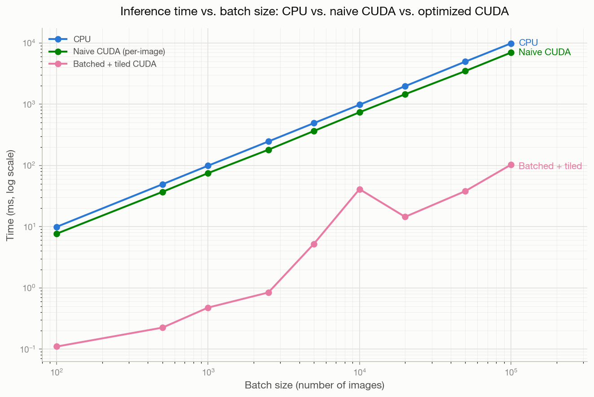

# CUDA Inference Engine

a small c++/cuda inference engine i'm building from scratch to learn how ml inference actually works under the hood instead of treating `model(x)` as a black box. plan is to train an mlp on mnist in pytorch, export the weights, then run inference in c++ first and then in cuda.

## status

cpu and gpu inference pipelines are both complete and matching. trained an mlp on mnist in pytorch, exported weights as raw float32 binaries, built a c++ loader, ran inference on 100 test images on the cpu, then reimplemented the same forward pass as cuda kernels and confirmed identical predictions on the gpu. gpu path is optimized: persistent device weights (no re-uploading per call), a tiled shared-memory matmul kernel, and a fully batched pipeline processing all images in one launch instead of looping. benchmarked cpu vs naive per-image cuda vs the optimized batched/tiled pipeline across batch sizes from 100 to 100,000 images — see below.

- [x] cpu math: sum_vector, dot_product, vector_add, argmax, matvec, matmul, relu, softmax
- [x] 2-layer mlp forward pass on hardcoded weights
- [x] split into headers + cmake build (`include/`, `src/`, `tests/`, CMakeLists.txt)
- [x] pytorch training + weight export (`scripts/train.py`, `scripts/export_weights.py`)
- [x] c++ weight loader reading raw float32 binaries (`src/loader.cpp`)
- [x] full c++ inference on 100 mnist test images — 99/100 correct, 100/100 match pytorch
- [x] cuda kernels for matvec, relu, bias add, wired into a full `predict_cuda` pipeline
- [x] gpu inference on 100 mnist test images, matching cpu predictions
- [x] tiled matmul w/ shared memory, batched inference (all images in a single pipeline launch)
- [x] benchmarks vs cpu, naive cuda, optimized cuda across batch sizes 100–100,000

## build & run

```
cmake -S . -B build
cmake --build build
./build/final_test
```

if everything works:

```
matvec passed!
matmul passed!
relu passed!
softmax passed!
predict passed!
All tests passed!
```

to run the full inference test (requires exported weights in `scripts/weights/`):

```
./build/inference_test
```

output:

```
99/100 correct
100/100 match PyTorch predictions
```

to run the gpu inference test (requires a cuda-capable gpu):

```
./build/test_inference_cuda
```

output:

```
99/100 correct (CUDA)
100/100 match CPU predictions
```

## benchmarks

cpu inference, naive per-image cuda, and the optimized batched+tiled cuda pipeline, timed across a range of batch sizes (batches larger than 100 are synthesized by repeating the 100 real mnist test images). gpu timing is broken into host→device transfer, kernel compute, and device→host transfer using `cudaEvent_t`; cpu timing uses `std::chrono`. see `tests/benchmark_cuda.cu`.

| batch size | cpu (ms) | naive cuda (ms) | h2d (ms) | compute (ms) | d2h (ms) | gpu total (ms) |
|---|---|---|---|---|---|---|
| 100 | 9.92 | 7.67 | 0.035 | 0.063 | 0.012 | 0.11 |
| 500 | 49.22 | 37.00 | 0.114 | 0.097 | 0.013 | 0.22 |
| 1,000 | 98.88 | 74.83 | 0.313 | 0.143 | 0.020 | 0.48 |
| 2,500 | 245.84 | 180.24 | 0.584 | 0.225 | 0.030 | 0.84 |
| 5,000 | 490.73 | 364.81 | 4.564 | 0.473 | 0.199 | 5.24 |
| 10,000 | 979.79 | 737.09 | 39.15 | 1.075 | 0.738 | 40.96 |
| 20,000 | 1968.65 | 1453.97 | 11.48 | 1.504 | 1.448 | 14.43 |
| 50,000 | 4957.01 | 3477.91 | 33.37 | 3.707 | 0.976 | 38.05 |
| 100,000 | 9833.03 | 6957.89 | 93.55 | 7.295 | 1.814 | 102.66 |



takeaways:
- the optimized (batched + tiled) gpu pipeline is roughly 100-200x faster than both cpu and naive per-image cuda, consistently across every batch size tested — not just at large scale.
- cpu and naive cuda both scale linearly with batch size, since they redo the same fixed amount of work per image.
- at larger batch sizes, host→device transfer — not kernel compute — becomes the dominant cost in the gpu path. compute time barely grows (0.06ms → 7.3ms from 100 to 100,000 images) while transfer time grows much faster and noisier, which matches expectations: pcie bandwidth, not the math, is the real bottleneck once the model itself is this small and this optimized.
- h2d timing is noticeably noisy at 10k+ images (run-to-run variance from system-level factors like pcie bus arbitration), rather than a perfectly smooth curve — reported as measured rather than smoothed over.

## notes

matrices are flat 1d `std::vector<double>`, row-major, with `rows`/`cols` passed alongside. picked over `vector<vector<double>>` so the cuda port later doesn't need a memory layout rewrite.

softmax subtracts the max before `exp()` so `softmax({1000, 1000, 1000})` doesn't overflow.

gradient descent works by treating the loss as a hilly landscape and rolling downhill. the gradient tells you the slope at your current weights — how much each weight contributed to the loss. you subtract it: `weight = weight - lr × gradient`. do this thousands of times and the weights converge to values that minimize loss. backpropagation (`loss.backward()`) computes those gradients efficiently by working backwards through the network using the chain rule. `optimizer.step()` then applies the update.

learning rate controls step size. too small (e.g. sgd at `lr=0.001`) and the weights barely move — slow convergence. too large and you overshoot the minimum. `lr=0.1` is a typical starting point for sgd on mnist. adam adapts the lr per parameter automatically, making it less sensitive to the initial choice.
